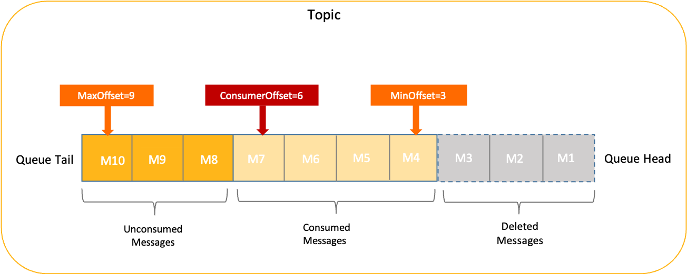

# 消息过期清理机制
## 消息存储机制
+ 原理机制
  ```txt
      RocketMQ使用存储时长作为消息存储依据，即每个节点对外承诺消息的存储时长。在存储时长范围内的消息都会被保留，无论消息消费与否；超过时长的限制的消息会被清理掉。
  ```

## RocketMQ消息文件删除策略:
+ 空间满策略
  ```txt
    在 RocketMQ中，消息保存时长并不能完整控制消息的实际保存时间，因为消息存储仍然使用本地磁盘，本地磁盘空间不足时，为保证服务稳定性消息仍然会被强制清理，导致消息的实际保存时长小于设置的保存时长。
    > 在磁盘不够的情况下，会优先保障服务稳定性而强制清理.
  ```
+ 定时删除策略(过期删除)
  > 见配置文件: fileReservedTime
+ 指定时间段删除策略(在特定时间段删除)
  > 见配置文件:deleteWhen :[](../001.深度解读%20RocketMQ%20存储机制/998.深度解读%20RocketMQ%20存储机制.png)

---

RocketMQ消息归档策略
+ 将历史消息归档到其他存储介质中，减小消息服务器的存储负担。
  - 即： [000.STU-DOCS/002.RocketMQ 多级存储设计与实现/998.RocketMQ 多级存储设计与实现.pdf](../002.RocketMQ%20多级存储设计与实现/998.RocketMQ%20多级存储设计与实现.pdf)

---

## 配置文件详解
```conf
   brokerClusterName = DefaultCluster
   brokerName = broker-a
   brokerId = 0
   deleteWhen = 04 # deleteWhen 参数用于指定 CommitLog 文件的清理时间点，默认值为每天凌晨 4 点
   fileReservedTime = 48  # 控制消息的保留时间，单位为小时
   brokerRole = ASYNC_MASTER
   flushDiskType = ASYNC_FLUSH # SYNC_FLUSH 模式下的 broker 保证在收到确认生产者之前将消息刷盘；ASYNC_FLUSH 模式下的 broker 则利用刷盘一组消息的模式，可以取得更好的性能。
```

---

### 消息在队列中的存储情况如下


---

## 参考
1. [消息过期清理机制](https://rocketmq.apache.org/zh/docs/featureBehavior/11messagestorepolicy#%E6%B6%88%E6%81%AF%E8%BF%87%E6%9C%9F%E6%B8%85%E7%90%86%E6%9C%BA%E5%88%B6)