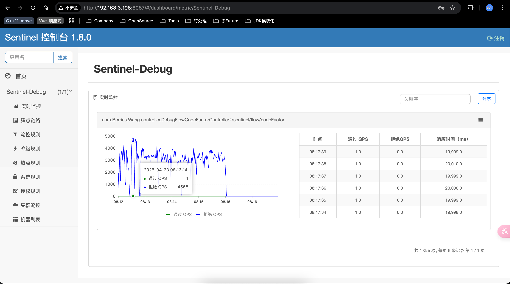
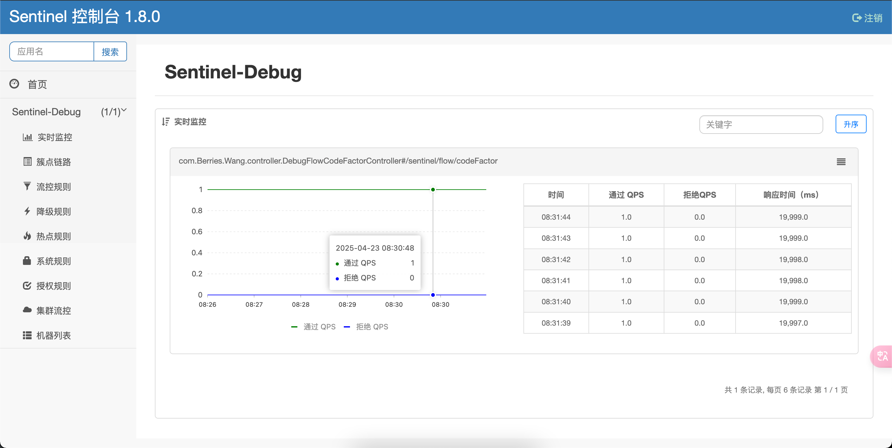

# RocketMQ + Sentinel 控制消费速率
## 背景
阻塞消费线程，控制消费速率。

## 实践一下
### 生产者
> [001.SOURCE-CODE/000.ROCKET-MQ-5.3.1-RELEASE/ROCKET-MQ-5.3.1-RELEASE/example/src/main/java/org/apache/rocketmq/example/simple/Producer.java](../001.SOURCE-CODE/000.ROCKET-MQ-5.3.1-RELEASE/ROCKET-MQ-5.3.1-RELEASE/example/src/main/java/org/apache/rocketmq/example/simple/Producer.java)

### 消费者
> [001.SOURCE-CODE/000.ROCKET-MQ-5.3.1-RELEASE/ROCKET-MQ-5.3.1-RELEASE/example/src/main/java/org/apache/rocketmq/example/simple/PushConsumer.java](../001.SOURCE-CODE/000.ROCKET-MQ-5.3.1-RELEASE/ROCKET-MQ-5.3.1-RELEASE/example/src/main/java/org/apache/rocketmq/example/simple/PushConsumer.java)

```txt
  注意配置:
     consumer.setConsumeTimeout(30); // 分钟
     设置超时时间,避免结果变为 TIME_OUT
       >> org.apache.rocketmq.client.impl.consumer.ConsumeMessageConcurrentlyService.ConsumeRequest
       ...
       else if (consumeRT >= defaultMQPushConsumer.getConsumeTimeout() * 60 * 1000) { // TIMEOUT，有什么影响?
                returnType = ConsumeReturnType.TIME_OUT;
            }
        ...
    
```


### 限流接口
> [进入Sentinel项目](https://github.com/Berries-Wang/Berries-Sentinel)
1. 000.SOURCE_CODE/000.Sentinel-1.8.0.RELEASE/Sentinel-Debug/src/main/java/com/Berries/Wang/BerriesSentinelDebugApplication.java
2. Dashboard: 000.SOURCE_CODE/000.Sentinel-1.8.0.RELEASE/sentinel-dashboard/src/main/java/com/alibaba/csp/sentinel/dashboard/DashboardApplication.java
3. 排队等待处理器: 000.SOURCE_CODE/000.Sentinel-1.8.0.RELEASE/sentinel-core/src/main/java/com/alibaba/csp/sentinel/slots/block/flow/controller/RateLimiterController.java


### 实现效果
Sentinel接口限流配置: QPS: 1 , 流控效果: 排队等待
##### Sentinel超时时间为500

可以发现，通过QPS为1，剩下的(4568)全部限流

以下为消费者程序日志(超时的被限流):
```txt
ConsumeMessageThread_CID_JODIE_1_15 Receive New Messages: 1 
响应内容: {"api":"限流: com.Berries.Wang.controller.DebugFlowCodeFactorController","status":200}
----> 消费耗时:[2]ms --> status: [CONSUME_SUCCESS]  --> returnType:[SUCCESS]
ConsumeMessageThread_CID_JODIE_1_3 Receive New Messages: 1 
响应内容: {"api":"限流: com.Berries.Wang.controller.DebugFlowCodeFactorController","status":200}
----> 消费耗时:[7]ms --> status: [CONSUME_SUCCESS]  --> returnType:[SUCCESS]
ConsumeMessageThread_CID_JODIE_1_5 Receive New Messages: 1 
响应内容: {"api":"限流: com.Berries.Wang.controller.DebugFlowCodeFactorController","status":200}
----> 消费耗时:[5]ms --> status: [CONSUME_SUCCESS]  --> returnType:[SUCCESS]
ConsumeMessageThread_CID_JODIE_1_2 Receive New Messages: 1 
响应内容: {"api":"限流: com.Berries.Wang.controller.DebugFlowCodeFactorController","status":200}
----> 消费耗时:[3]ms --> status: [CONSUME_SUCCESS]  --> returnType:[SUCCESS]
ConsumeMessageThread_CID_JODIE_1_8 Receive New Messages: 1 
响应内容: {"api":"限流: com.Berries.Wang.controller.DebugFlowCodeFactorController","status":200}
----> 消费耗时:[5]ms --> status: [CONSUME_SUCCESS]  --> returnType:[SUCCESS]
```

---

##### Sentinel超时时间设置为 99999999 <sub>通过Dashboard设置</sub>

可以发现，QPS为1，但是没有请求被限流

以下为消费者程序日志(无报错，正常消费):
```txt
ConsumeMessageThread_CID_JODIE_1_20 Receive New Messages: 1 
响应内容: {"api":"com.Berries.Wang.controller.DebugFlowCodeFactorController.codeFactor","status":200}
----> 消费耗时:[20000]ms --> status: [CONSUME_SUCCESS]  --> returnType:[SUCCESS]
ConsumeMessageThread_CID_JODIE_1_15 Receive New Messages: 1 
响应内容: {"api":"com.Berries.Wang.controller.DebugFlowCodeFactorController.codeFactor","status":200}
----> 消费耗时:[20000]ms --> status: [CONSUME_SUCCESS]  --> returnType:[SUCCESS]
ConsumeMessageThread_CID_JODIE_1_17 Receive New Messages: 1 
响应内容: {"api":"com.Berries.Wang.controller.DebugFlowCodeFactorController.codeFactor","status":200}
----> 消费耗时:[20001]ms --> status: [CONSUME_SUCCESS]  --> returnType:[SUCCESS]
ConsumeMessageThread_CID_JODIE_1_1 Receive New Messages: 1 
响应内容: {"api":"com.Berries.Wang.controller.DebugFlowCodeFactorController.codeFactor","status":200}
----> 消费耗时:[19999]ms --> status: [CONSUME_SUCCESS]  --> returnType:[SUCCESS]
ConsumeMessageThread_CID_JODIE_1_19 Receive New Messages: 1 
响应内容: {"api":"com.Berries.Wang.controller.DebugFlowCodeFactorController.codeFactor","status":200}
----> 消费耗时:[20001]ms --> status: [CONSUME_SUCCESS]  --> returnType:[SUCCESS]
ConsumeMessageThread_CID_JODIE_1_4 Receive New Messages: 1 
响应内容: {"api":"com.Berries.Wang.controller.DebugFlowCodeFactorController.codeFactor","status":200}
----> 消费耗时:[19999]ms --> status: [CONSUME_SUCCESS]  --> returnType:[SUCCESS]
ConsumeMessageThread_CID_JODIE_1_10 Receive New Messages: 1 
响应内容: {"api":"com.Berries.Wang.controller.DebugFlowCodeFactorController.codeFactor","status":200}
----> 消费耗时:[19999]ms --> status: [CONSUME_SUCCESS]  --> returnType:[SUCCESS]
ConsumeMessageThread_CID_JODIE_1_16 Receive New Messages: 1 
响应内容: {"api":"com.Berries.Wang.controller.DebugFlowCodeFactorController.codeFactor","status":200}
----> 消费耗时:[20000]ms --> status: [CONSUME_SUCCESS]  --> returnType:[SUCCESS]
ConsumeMessageThread_CID_JODIE_1_11 Receive New Messages: 1 
响应内容: {"api":"com.Berries.Wang.controller.DebugFlowCodeFactorController.codeFactor","status":200}
----> 消费耗时:[20002]ms --> status: [CONSUME_SUCCESS]  --> returnType:[SUCCESS]
ConsumeMessageThread_CID_JODIE_1_13 Receive New Messages: 1 
```